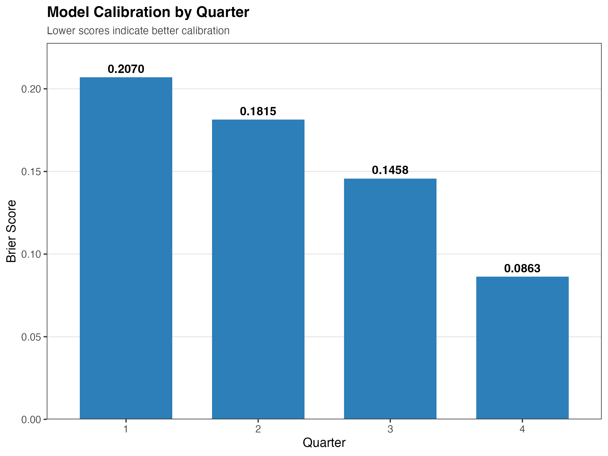
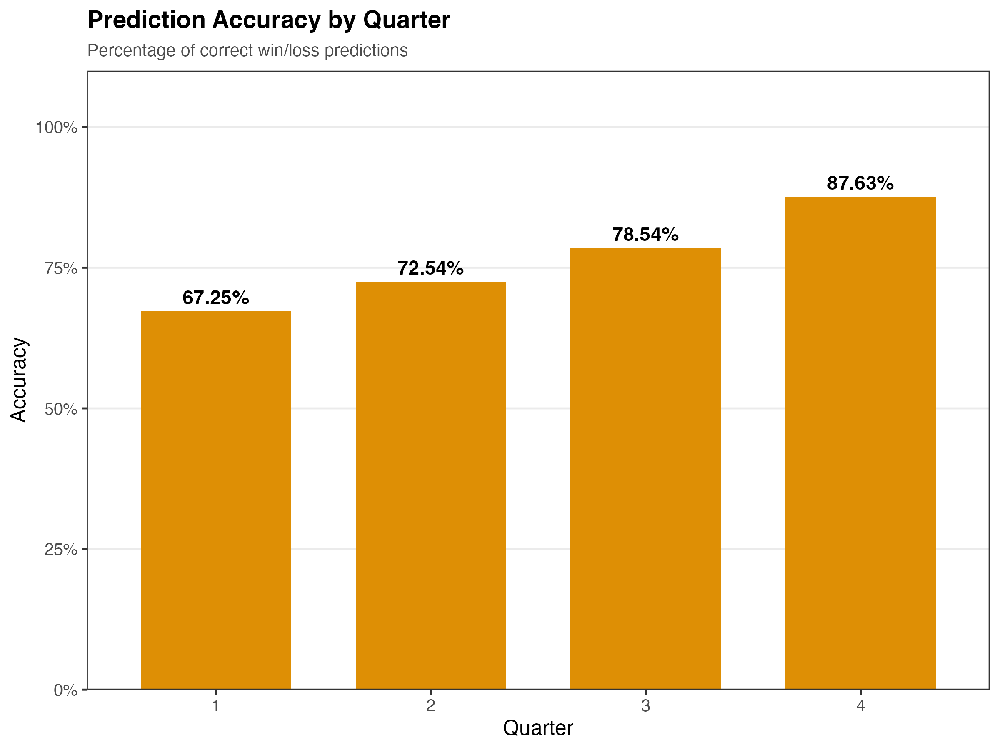
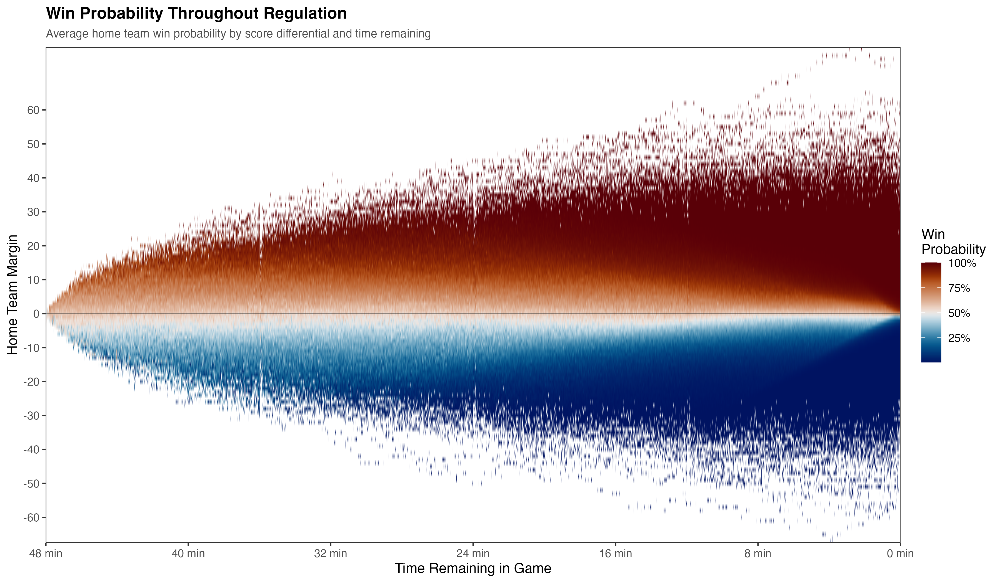
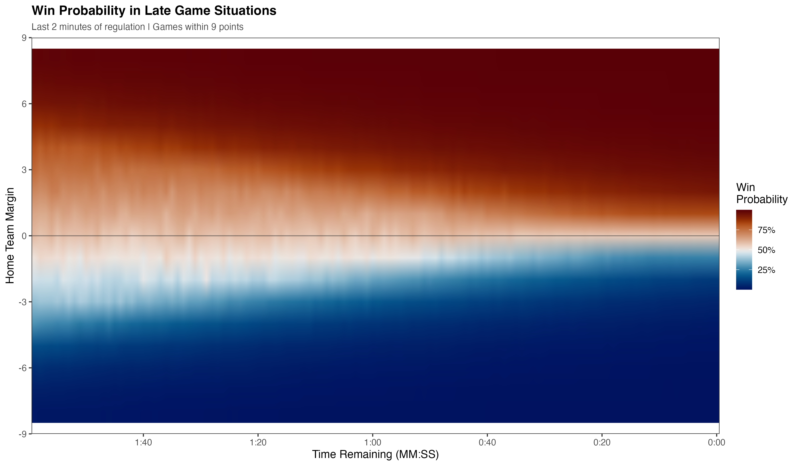
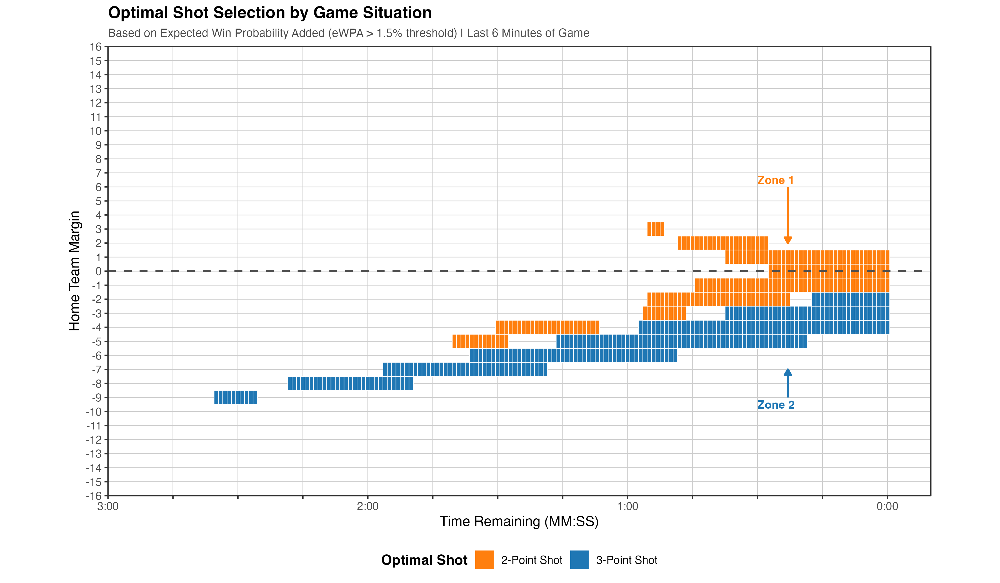

# Late Game Shot Optimization in the NBA

This project uses a neural network based win probability model to inform optimal shot selection in the NBA. In this work, I sought to examine whether there were any advantages to be had by rejecting the now conventional wisdom of 3>2 when it comes to shot optimization in the NBA. The crux of my hypothesis was that while yes, 3 > 2, and a 3 converted at 34% of the time still has an expected value higher than a 2 at 50% of the time, the higher conversion rate of the 2 could be preferential to teams when leading close late in the game.

To attempt to quantify this, I created a win probability model from scratch using play-by-play data from the R package hoopR collected from 2016 through 2025. I settled on a neural net architecture and fed it features very similar to those used by the inpredictable win probability model. The model ended up achieving an overall accuracy of 76.6% and a brier score of 0.154. Breakdowns of those scores by quarter can be seen below:

  
  

After completing the model, I found the mean win probability for the home team given time and score (and assuming the spread was 0) and visualized the results. Additionally, I refined this to only include the last 2 minutes and scores within 9 points in either direction. These can be seen below:

  
  

After this, I used the same play-by-play data to find the league average values for 3 and 2 point percentage, as well as rebound rates given both types of shots. Finally, using this data I calculated the change in expected winning percentage given what type of shot the home team attempted (be that a 3 or 2). To make the results more interpretable, I used a threshold of + or - 1% in eWP to decide whether a team should shoot a 3 or 2 given time and score (again, assuming a 0 point pregame spread). These results can be seen below:

  

The findings are actually more nuanced than I originally thought, and suggest 4 separate scenarios where there is an optimal shot type. The zones do not fit into neat and orderly boxes, but I will do my best to generalize below:

Zone 1
- Down between -7 and -2 points and between 2:40 and 0:40 left exists our first zone. As time dwindles down, so too does the target score (this will be a recurring pattern between groups), starting about 20s later when it moves from -7 to -6. Teams here are trying to conservatively keep the game within striking distance and do everything in their power to stay attached while minimizing the risk of slipping too far behind. Their optimal shot is the 2 pointer.

Zone 2
- Next, from +5 to down -1 and following the same time frame (2:40 to 0:40), is our second zone. It follows the same pattern as the first, where as time winds down the target also decreases (from 5 to 4 after about 20s, and so on). The goal of this group is to expand their lead as much as possible before the final 40s. Their optimal shot is the 3 pointer.

Zone 3
- After this, we have +6 to down -1 between 2:30 and 0:00. Again, it follows a similar (but slower) pattern as before where as time expires the score to enter this group moves closer to -1. This group is about maintaining an existing lead by converting field goals and maintaining possession (higher OREB% on 2s). Their optimal shot is the 2 pointer. 

Zone 4
- Finally, we have -15 to -2, between about 4:30 remaining and 0:00. As time decreases the deficit must also (from -15, to -14, etc.), but this group has the largest range and overlap between acceptable scores. This zone is trying to climb back into the game and is willing to take higher variance risks to do so. Their optimal shot is the 3 pointer. 

## Usage

All datasets can be found in the `datasets` folder. Additionally, the `get_pbp.R` file can pull this data from hoopR and clean it. 

`neural_net.R` will train the neural net model and save it to `models` folder. 
`nn_testing.R` will create the plots seen above for the win probability model.
`shot_values.R` parses the play-by-play data for league average shot values. 

And finally, `eWP.R` calculates expected winning percentage added after taking a 3. 

## Further work, caveats, etc.

The biggest caveat here is that these results directly derived from my win probability model. That means that if the model is poorly calibrated or inaccurate, the results will be off. I feel fairly confident in the model itself, however there are definitely things to iron out in the future (namely getting a better handle on possessions and possession state).

Additionally, the eWPA calculation does not consider foul rates when considering 2 vs 3. My suspicion is that including foul rates would increase the viability of 2s across the board. Shot types are slightly different. Shot types are also not considered (be that an at rim 2, corner 3, etc.) but are instead generalized as 2 or 3. The other big caveat is that these estimates of shooting quality are league averages, and not team or player specific. I can imagine the optimal shot type for the KD Warriors might look slightly different than the league average.